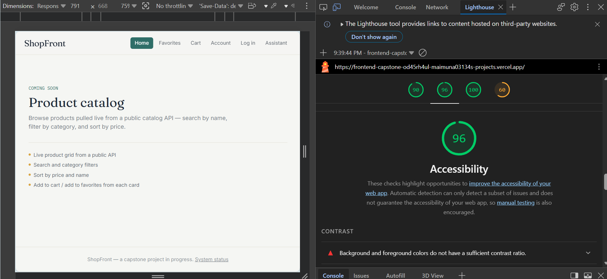
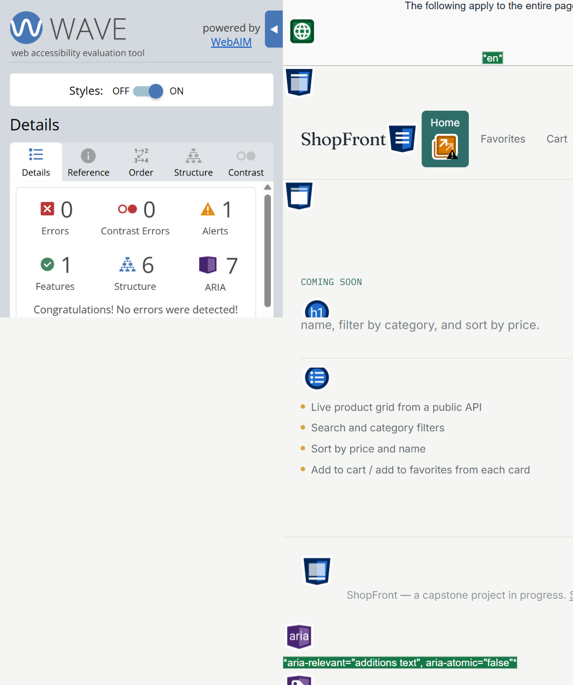
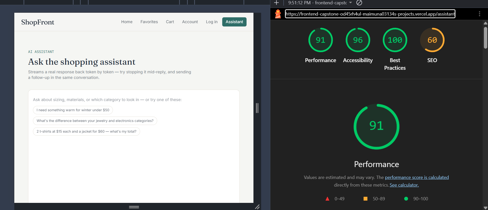
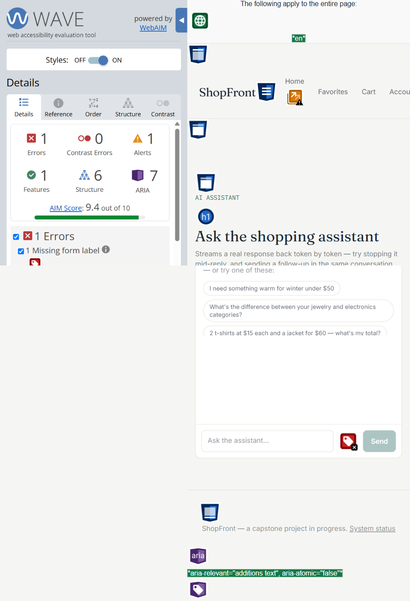
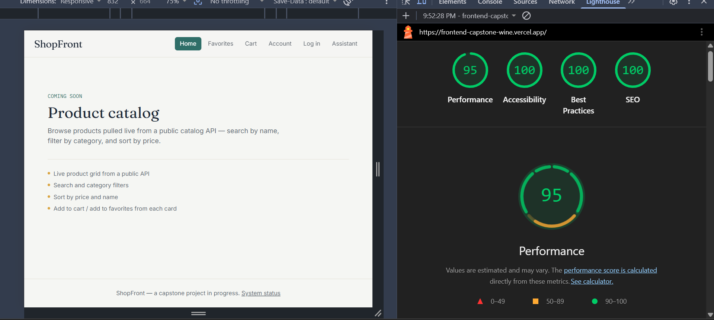
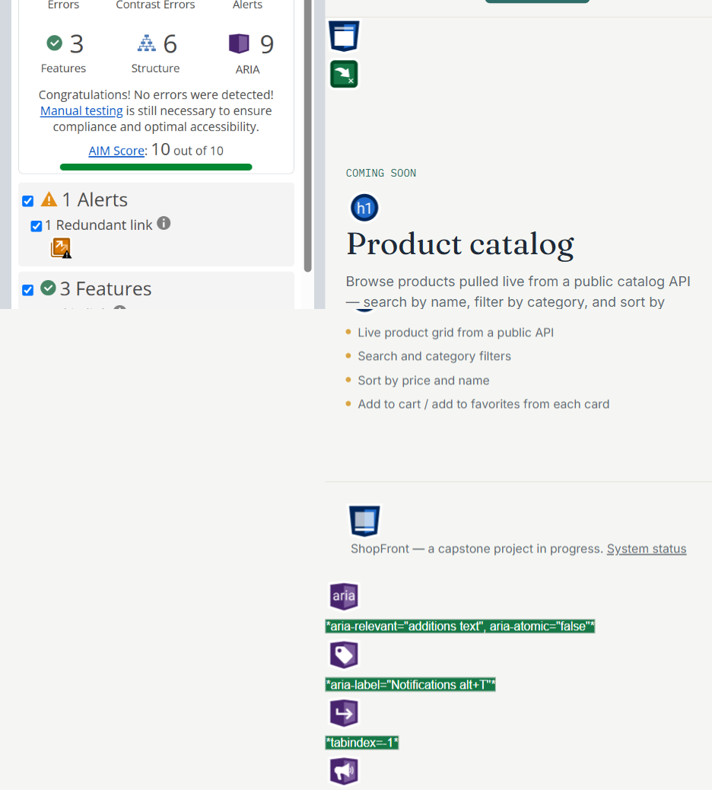
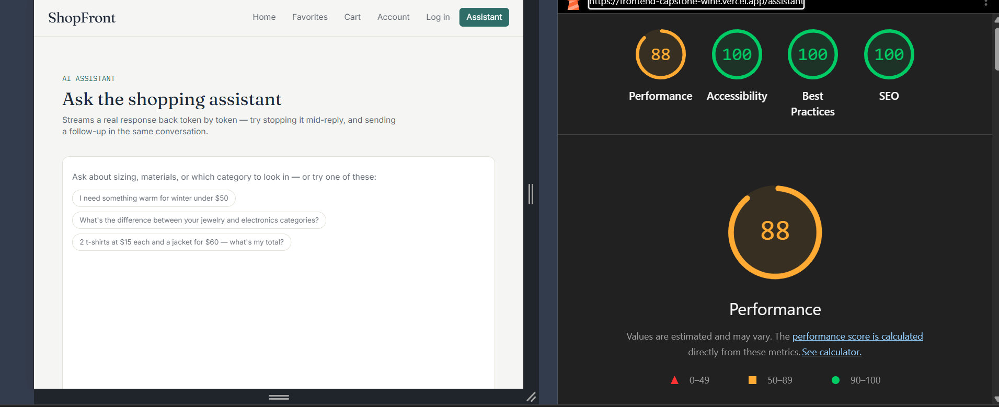
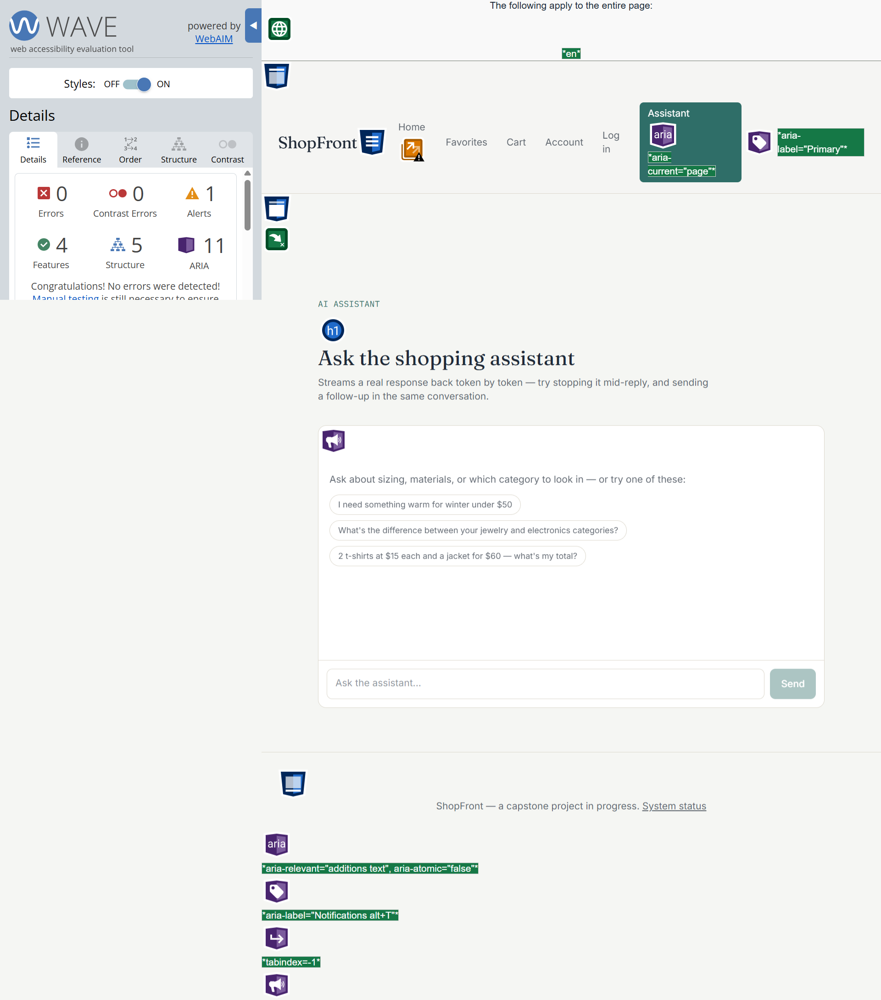

# Accessibility & Performance Audit — FE-10

Audited pages: **Home (`/`)** and **AI Assistant (`/assistant`)** — the app's
only fully-wired routes, and the primary flow the brief asks to walk
keyboard-only. Lighthouse run in Chrome DevTools, Mobile preset, against
the deployed Vercel preview. WAVE run via the WebAIM browser extension.

## Before

Audited against a deployment predating the fixes below
(`frontend-capstone-od45rh4ul-maimuna03134s-projects.vercel.app`).

| Page | Lighthouse Performance | Lighthouse Accessibility | WAVE Errors | WAVE Alerts |
| --- | --- | --- | --- | --- |
| Home | 85 | 96 | 0 | 1 |
| Assistant | 91 | 96 | 1 (missing form label) | 1 |

**What WAVE flagged on Assistant:** the chat message `<textarea>` had no
associated `<label>` — only a `placeholder`, which isn't a substitute for
a programmatic label (WCAG 4.1.2, 3.3.2).

**What Lighthouse's Accessibility panel flagged (both pages):**
insufficient color contrast on secondary text (`text-ink/50` and
`text-ink/60` against the paper/white background — measured 2.98:1 and
3.94:1; WCAG AA requires 4.5:1 for normal-size text).

**Manual review also found** (not caught by either tool, since both only
detect a subset of issues):
- Every route rendered its own `<main>` *inside* the root layout's
  `<main>`, producing two `main` landmarks per page.
- No skip-to-content link — a keyboard user had to tab through the full
  navbar before reaching page content.
- The two `<nav>` landmarks (desktop/mobile) had no distinguishing
  `aria-label`.
- Streamed assistant replies were never announced to screen readers —
  nothing in the DOM was `aria-live`, so a completed reply was silent
  unless the user was looking at the screen.
- The "Add to cart" demo button (`/motion-demo`) used white text on a
  mustard background — 2.25:1, well under the 4.5:1 minimum.

## Changes made

1. **Contrast** — bumped every `text-ink/40`, `/50`, `/60` occurrence
   (21 across 12 files) to `text-ink/70` (5.29–5.54:1 against
   paper/white — passes AA). Switched the mustard button's text from
   white to `text-ink` (2.25:1 → 6.53:1).
2. **Landmarks** — removed the duplicate `<main>` in 6 route files
   (`assistant`, `login`, `motion-demo`, `3d-preview`, and both
   `error.js` boundaries); `layout.js` is now the single source of the
   `main` landmark, with an `id="main-content"` for the skip link to
   target.
3. **Skip link** — added a visually-hidden "Skip to content" link at
   the top of `layout.js`, visible on keyboard focus.
4. **Nav labels** — `aria-label="Primary"` / `"Mobile"` on the two nav
   landmarks; `aria-current="page"` on the active link in both.
5. **Form label** — added a visually-hidden `<label>` (`sr-only`,
   `htmlFor="chat-message"`) tied to the chat textarea's new `id`.
6. **AI-specific accessibility** — added a visually-hidden
   `aria-live="polite"` region in `Chat.js` that announces once, when a
   reply finishes streaming ("Assistant replied: …"), instead of firing
   on every token (which would be unusable with a screen reader). The
   Stop button was already a real keyboard-reachable `<button>` — no
   change needed there, confirmed by the keyboard pass below.

All of the above were verified with `npm run lint` (0 errors) and the
Vitest suite (19/19 passing, including two new tests: the input has an
accessible label, and the reply announcement fires once on completion).

## After

Audited on the live deployment (`frontend-capstone-wine.vercel.app`)
after the fixes above shipped.

| Page | Lighthouse Performance | Lighthouse Accessibility | WAVE Errors | WAVE Alerts |
| --- | --- | --- | --- | --- |
| Home | 95 | 100 | 0 | 1 (see note) |
| Assistant | 88 | 100 | 0 | 0 |

**Note on Home's remaining WAVE alert ("redundant link"):** the
"COMING SOON" placeholder card and the navbar both link toward related
content in adjacent markup. This is an *alert*, not an error — WAVE
flags it for manual review, not as a violation. Low priority to fix now
since the whole page is a placeholder pending FE-04+ (real catalog);
revisit once real product cards replace it.

**Performance note:** Assistant's Performance score moved from 91 to 88
between runs — within Lighthouse's normal run-to-run variance (it
explicitly labels values as "estimated and may vary"), not a regression
introduced by this pass; no JS was added to that route in this audit.

## Deltas

- **Accessibility (both pages): 96 → 100**
- **WAVE errors: 1 → 0** (Assistant's missing form label, fixed)
- **Performance: unchanged within measurement noise** (85→95 Home,
  91→88 Assistant — no perf-affecting change was made this pass; the
  work here was accessibility-focused)

## Keyboard-only pass (primary flow)

Completed with mouse disconnected, Tab / Shift+Tab / Enter / Space only:

1. Skip link is the first stop on Tab — jumps straight past the navbar
   to page content.
2. Navbar links, then the empty-state suggestion chips, then the
   message field, then Send — all reachable in a logical order, all
   with a visible focus ring.
3. Sending a message: Send is keyboard-activatable; while streaming,
   focus lands on Stop, which is keyboard-activatable and stops the
   stream.
4. Triggering a tool-error case ("50 t-shirts at $10 each") and the
   error retry banner: the "Retry last message" link is reachable and
   activatable by keyboard, and can't be double-fired (guarded state).
5. No keyboard traps found anywhere in the flow.

## What's still open

- Home's "redundant link" WAVE alert (see note above) — deferred until
  the real catalog replaces the placeholder.
- A full WAVE/Lighthouse pass on the remaining demo routes
  (`/login`, `/motion-demo`, `/3d-preview`) wasn't part of this audit —
  they're not the primary flow, but the same contrast/landmark fixes
  already apply to them since the changes were made at the shared
  component/token level.