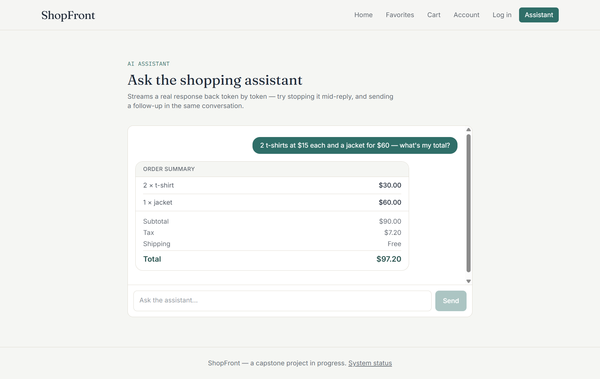
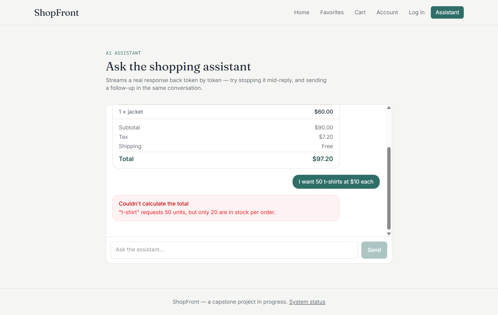
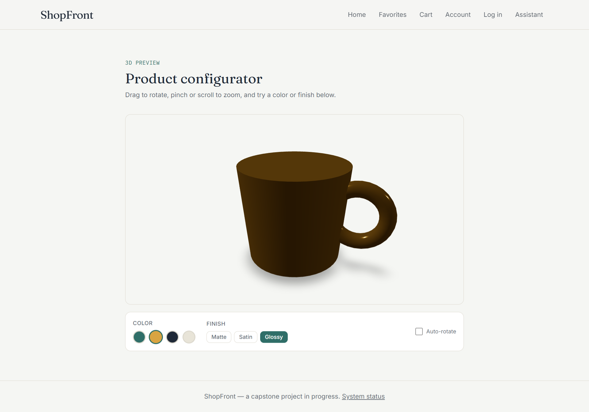

# ShopFront — Frontend AI Engineering capstone

An AI shopping assistant built with Next.js and the Vercel AI SDK: a
Gemini-powered chat that streams responses, calls a real server-side tool
to calculate order totals, and is hardened with error handling,
accessibility fixes, tests, and basic production abuse-protection. Three
standalone feature demos (a 3D product configurator, a hand-written GLSL
shader hero, and a reusable button motion system) round out the weekly
assignments this capstone was built from.

**Scope, honestly:** the product catalog, cart, login, and account pages
are still placeholder screens (see [Routes](#routes-current-skeleton)).
Each week targeted one specific frontend-AI skill — streaming, tool
calling, testing, accessibility, 3D, shaders, motion, production hardening
— rather than building the full store end-to-end. The AI Assistant is the
one fully-wired path through the app, and it's the flow every other
section of this README is written around.

## Live URL

**https://frontend-capstone-wine.vercel.app/**

- Fully-wired flow: **[/assistant](https://frontend-capstone-wine.vercel.app/assistant)**
- Other demos: [/3d-preview](https://frontend-capstone-wine.vercel.app/3d-preview) · [/shader-hero](https://frontend-capstone-wine.vercel.app/shader-hero) · [/motion-demo](https://frontend-capstone-wine.vercel.app/motion-demo)

## Screenshots

<!-- Replace these with real screenshots — see docs/screenshots/README -->

| Assistant — reply + tool result | Error state | 3D preview |
|---|---|---|
|  |  |  |

## Getting started

\`\`\`bash
git clone https://github.com/maimuna03134/frontend-capstone.git
cd frontend-capstone
npm install
cp .env.example .env.local   # then add your own key — see below
npm run dev
\`\`\`

Open **http://localhost:3000/assistant** — try "I need something warm for
winter under $50" for a plain reply, or "2 t-shirts at $15 each and a
jacket for $60 — what's my total?" to see the tool call.

## Environment variables

| Variable | Required | Where to get it | Used for |
| --- | --- | --- | --- |
| `GOOGLE_GENERATIVE_AI_API_KEY` | Yes — the assistant won't respond without it | Free key at [aistudio.google.com/apikey](https://aistudio.google.com/apikey) | Gemini calls in `app/api/chat/route.js` |
| `NEXT_PUBLIC_SITE_NAME` | No (has a default) | — | Display name, public |
| `NEXT_PUBLIC_API_BASE_URL` | No (has a default) | — | Placeholder for the future product catalog API |

Locally: copy `.env.example` to `.env.local` (gitignored) and fill in your
key. On Vercel: Project → Settings → Environment Variables, added to both
Production and Preview.

## Architecture overview

\`\`\`
app/
  api/chat/route.js     Server route: rate limit → input caps → streamText
                         (Gemini + one tool) → categorized error mapping
  assistant/             The chat UI: Chat.js (message renderer, all tool
                          states, error/retry, empty state) + tests
  login/                 A real (client-validated) form — the rest of
                          account/cart/checkout are still placeholders
  3d-preview/             React Three Fiber product configurator, lazy-
                          loaded client-only
  shader-hero/            Raw WebGL2 fragment shader hero, same lazy-load
                          pattern
  motion-demo/            Reusable stateful-button motion system
  error.js, */error.js   Route-level error boundaries
lib/
  tools.js                The AI tool's Zod schema + execute function
  chat-config.js          Model + system prompt
  rate-limit.js            In-memory per-IP rate limiter (see below)
e2e/                      Playwright: one primary-flow test, AI route mocked
.github/workflows/ci.yml  Lint + Vitest + Playwright on every push/PR
\`\`\`

**Request flow for a chat message:** client `useChat` (streams via
`DefaultChatTransport`) → `POST /api/chat` → rate limit check → input-size
validation → `streamText` with the Gemini model and one registered tool
(`calculateCartSummary`) → `toUIMessageStreamResponse`, which streams text
deltas and typed tool-call parts (`input-streaming` →
`input-available` → `output-available`/`output-error`) back down → `Chat.js`
renders each part type as a distinct component (never raw JSON).

## Key decisions

- **No real cart/product data behind the tool.** `calculateCartSummary`
  takes items straight from what the shopper types in chat rather than
  reading a real cart, because the cart page doesn't exist yet — this
  kept the tool-calling assignment (FE-07) scoped to the actual skill
  being tested instead of also building cart state early.
- **Plain `useState` + Zod in `LoginForm`, not react-hook-form.** The
  project's own conventions (`CLAUDE.md`) call for react-hook-form; this
  form uses manual state instead. It was a deliberate scope call to keep
  the FE-09 testing assignment (which needed *a* validated form to test,
  not a production auth form) fast to ship — worth revisiting when real
  auth is built.
- **In-memory rate limiting, not Redis/Upstash.** Documented as an honest
  tradeoff below — no paid infra behind this capstone, so it stops casual
  single-IP abuse but not a distributed attack. Good enough for a demo
  project's actual threat model.
- **Procedural geometry over a `.glb` file** for the 3D preview, and
  **raw WebGL2 over Three.js** for the shader hero — both zero extra
  asset weight, and both were the more direct way to actually learn the
  underlying APIs (uniforms, buffers, the render loop) rather than going
  through a higher-level abstraction for a one-off demo.

## How AI tools built this

Built with Claude as a hands-on pair programmer across every assignment,
not just for boilerplate. Specifics:

- **Wrote and iterated on almost all the code in this repo** — the tool
  definition and Zod schema, the chat UI's four tool-call states, error
  categorization, the test suites, the WebGL shader, the R3F scene —
  based on my direction on scope and priorities each week.
- **Actually ran the test suite and found a real bug**, rather than just
  writing tests that were guaranteed to pass: `LoginForm`'s validation
  was showing "Enter a valid email address" for an *empty* email field
  instead of "Enter your email," because Zod returns multiple issues per
  field and the error-collection loop was keeping the last one instead of
  the first. Caught while writing the empty-submit test, fixed, re-run to
  confirm.
- **Computed exact numbers instead of eyeballing them** for the
  accessibility pass — actual WCAG contrast ratios for every text-opacity
  token in use (`text-ink/40` through `/70` against both `paper` and
  `white`), which is how the 2.98:1 and 3.94:1 failures got found and
  fixed to `/70` (5.29–5.54:1) rather than guessed at.
- **Debugged real environment issues**, not just app code: a Vitest+Vite
  config problem where `.js` files with JSX weren't being transformed
  (fixed via an `esbuild.loader` override), and a Windows-specific
  `vitest-pool` worker timeout tied to a space in the project's file path
  (fixed by switching to the `threads` pool).
- **What I did myself:** decided what to build each week and in what
  order, chose the product/scope tradeoffs above, ran every Lighthouse/
  WAVE audit and reported real scores back (nothing here was
  self-reported by the AI), tested on real devices, and reviewed/pushed
  every commit.

## Production hygiene

- **`maxDuration = 30`** on the chat route — a stuck stream can't hang a
  serverless function indefinitely.
- **Rate limiting** (`lib/rate-limit.js`): an in-memory, per-IP sliding
  window (20 requests / 10 minutes) checked *before* the request body is
  even read, so a blocked request never reaches the model. Honest
  limitation: this is per-serverless-instance state, so it resets on cold
  starts and doesn't coordinate across concurrently-running instances —
  it stops the common case (one client hammering the endpoint), not a
  distributed attacker. A real production deployment would move this to
  Redis/Upstash.
- **Input caps**, independent of the rate limiter: a conversation is
  capped at 30 messages and each message at 4,000 characters, both
  checked server-side before the model is called, so no single request
  can run up an unbounded bill even if it slips past the rate limit.
- **Errors never leak provider internals** — `categorizeError` in
  `route.js` maps any thrown error to one of a few safe tokens
  (`rate-limit` / `network` / `server`) before it reaches the client.

## Testing

\`\`\`bash
npm run test        # Vitest + React Testing Library (component tests)
npm run test:watch  # same, watch mode
npm run test:e2e    # Playwright end-to-end (first time: npx playwright install --with-deps)
\`\`\`

Nothing in the test suite calls the real AI route — `useChat` is mocked
in `Chat.test.js`, and the Playwright test mocks `/api/chat` with a
hand-built, protocol-accurate response.

| Test file | Covers |
| --- | --- |
| `app/assistant/Chat.test.js` | Message renderer across every state: empty, text, pending/streaming, categorized error + retry, all four tool-call states, accessible label, and the polite reply announcement |
| `app/assistant/CartSummaryCard.test.js` | The tool-result component in isolation |
| `app/login/LoginForm.test.js` | The validated form — labels, empty-submit errors, invalid-email error, valid submit |
| `lib/rate-limit.test.js` | The rate limiter's window/reset/per-IP logic |
| `e2e/assistant-primary-flow.spec.js` | Primary flow end-to-end |

CI (`.github/workflows/ci.yml`) runs lint + both suites on every push and
pull request to `main`.

## Accessibility

Lighthouse Accessibility: **100/100** on Home and Assistant (mobile
preset), 0 WAVE errors. Full before/after audit with screenshots in
[`AUDIT.md`](./AUDIT.md).

## Feature details

### AI tool calling — `calculateCartSummary`

Calculates an order total for items a shopper describes in chat —
subtotal, 8% flat tax, shipping (flat $5, free at $50+), and total.

**Input** (`lib/tools.js`, Zod-validated): `items` — array (min 1) of
`{ name: string, quantity: number (1–20), unitPrice: number (> 0) }`

**Output (success):** `{ items: [...with lineTotal], subtotal, tax, shipping, total, currency: "USD" }`

**Errors:** throws if any item requests more than 20 units — renders as a
designed error card (`CartSummaryError`), not a crash.

| Tool state | Rendered as |
| --- | --- |
| `input-streaming` | "Reading the order..." shell |
| `input-available` | "Calculating totals..." shell + parsed items |
| `output-available` | `CartSummaryCard` — itemized summary |
| `output-error` | `CartSummaryError` — designed error card |

### Error, empty, and edge-case handling

| Case | Handled by |
| --- | --- |
| Network failure before send | `getErrorCopy()` detects offline/fetch errors client-side |
| API error mid-stream | Server `categorizeError()` → safe token → matching client copy |
| Rate limit / oversized request | `rate-limit` / `invalid-request` tokens, same path as above |
| Failed tool execution | `output-error` tool part → `CartSummaryError` |
| Empty input | Disabled Send button, no request sent |
| First-run empty state | Click-to-send suggestion chips |
| Slow response | Skeleton-shaped shell sized like a real reply, not a spinner |
| Route render failure | `app/error.js`, `app/assistant/error.js` |
| Double-clicking retry | `isRetrying` guard ignores the second click |

Mobile Safari: `dvh` instead of `vh`, 16px input font (prevents iOS
auto-zoom), `overscroll-contain` so rubber-band scroll doesn't fight the
pinned auto-scroll.

### 3D product preview — `/3d-preview`

React Three Fiber configurator: orbit, zoom, swap color/finish on a
procedurally-built mug (cylinder + torus — no model file, zero download
weight). Canvas lazy-loaded via `next/dynamic(..., { ssr: false })`, `dpr`
capped at 2, `powerPreference: "low-power"`, a single `<ContactShadows>`
instead of a real shadow map, plain lights instead of an HDRI. Falls back
to a static panel on `prefers-reduced-motion` or missing WebGL, with an
explicit "show anyway" override.

### Shader hero — `/shader-hero`

Hand-written GLSL fragment shader (raw WebGL2, no library): three layered
sine waves build a drifting flow field colored through the brand palette,
with a soft vignette and a grain pass. Uses all three core uniforms —
`u_time` drives the drift, `u_resolution` corrects the aspect ratio,
`u_mouse` pulls the field gently toward the cursor. Pixel ratio capped at
2, render loop pauses on tab-hide, and `prefers-reduced-motion` skips
WebGL entirely for a static CSS gradient in the same palette.

### Motion system — `/motion-demo`

One `StatefulButton` component (idle → hover → loading → success/error,
disabled-while-loading) used twice with different copy/tone to show it's
a system. Cross-fades via opacity/transform only inside a fixed-size grid
cell — no layout thrash. Spam-clicks are guarded; `prefers-reduced-motion`
is honored via the global CSS rule in `globals.css`.

## Routes (current skeleton)

| Route | Screen |
| --- | --- |
| `/` | Product catalog (placeholder) |
| `/products/[id]` | Product detail (placeholder) |
| `/cart` | Cart (placeholder) |
| `/checkout` | Checkout (placeholder) |
| `/favorites` | Favorites (placeholder) |
| `/login` | Log in — real client-side validated form |
| `/account` | Account settings (placeholder) |
| `/health` | Health check |
| `/assistant` | **AI Shopping Assistant — fully wired** |
| `/3d-preview` | 3D product configurator |
| `/shader-hero` | GLSL shader hero |
| `/motion-demo` | Button motion system |

## Stack

- Next.js 16 (App Router, JavaScript — no TypeScript)
- Vercel AI SDK (`ai`, `@ai-sdk/react`, `@ai-sdk/google`) + Gemini
- Tailwind CSS v4 (design tokens in `app/globals.css`)
- React Three Fiber + drei + three.js (3D preview only, lazy-loaded)
- Zod (tool + form validation)
- Vitest + React Testing Library + Playwright
- Vercel (hosting, CI via GitHub Actions)
- Planned: Firebase (Auth + Realtime Database) once accounts/orders need
  a real backend

## Project docs

- [`AUDIT.md`](./AUDIT.md) — accessibility/performance audit, before/after
- [`CLAUDE.md`](./CLAUDE.md) — stack, conventions, and rules for
  AI-assisted work on this repo